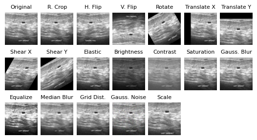

# Analyzing Data Augmentation for Medical Images: A Case Study in Ultrasound Images

This repository is the official implementation of [Analyzing Data Augmentation for Medical Images: A Case Study in Ultrasound Images](https://arxiv.org/abs/XXXX.12345).

<p align="center">
  
</p>

## Requirements

To replicate our model training, install the required packages using the following command:

```bash
pip install -r cc_requirements.txt
```

To install the required packages for the evaluation, use the following command:

```bash
pip install -r requirements.txt
```

## Training

### Data Preparation

Before running any of the experiments, the datasets ([BUSI](https://scholar.cu.edu.eg/?q=afahmy/pages/dataset) and [BUS-BRA](https://zenodo.org/records/8231412)) must be downloaded. Furthermore, the BUS-BRA dataset must be divided into stratified training and validation splits that ensure that different images of the same patient are not present in both splits. Run the following script in the `data_preparation` directory with and without the `--birads` flag to prepare the dataset:

```bash
python bus_bra.py
    --input_dir /path/to/dataset
    --output_dir /path/to/output
    [--birads]
```

### Individual Augmentation Experiments

To train the model(s) using each different transform, run the following command:

```bash
python individual_effects.py 
    --data_dir ...
    --config_dir ./config
    --log_dir ./individual_effects
    --workers N
    --seed 0 
    --dataset [busi|bus_bra|bus_bra_birads]
```

Alternatively, the file `individual_effects.sh` provides a script to run all experiments in parallel in a SLURM environment:

```bash
sbatch individual_effects.sh [busi|bus_bra|bus_bra_birads]
```

### Paired Augmentation Experiments

To train the model(s) using each ordered pair of transforms on the BUSI dataset, run the following command:

```bash
python paired_effects.py
    --data_dir ...
    --config_dir ./config
    --log_dir ./paired_effects
    --workers N
    --seed 0
    --dataset busi
```

Alternatively, the file `paired_effects.sh` provides a script to run all experiments in parallel in a SLURM environment:

```bash
sbatch paired_effects.sh busi
```

### TrivialAugment Experiments

To train the model(s) using TrivialAugment with different sets of transforms, run the following command:

```bash
python trivial_augment.py
    --data_dir ...
    --config_dir ./config
    --log_dir ./trivial_augment
    --workers N
    --seed 0 
    --dataset [busi|bus_bra|bus_bra_birads]
    --subset [all|top5|top10|geometric|photometric]
```

Alternatively, the file `trivial_augment.sh` provides a script to run all experiments in parallel in a SLURM environment:

```bash
sbatch trivial_augment.sh [busi|bus_bra|bus_bra_birads] [all|top5|top10|geometric|photometric]
```

## Evaluation

The evaluations for the individual, paired, and TrivialAugment experiments is performed using the Jupyter notebooks in the `analysis` directory. After running the training scripts, their respective notebooks can be used to analyze the results.

If you simply want to re-run our analyses using the raw Tensorboard logs, they can be downloaded from [here](https://drive.google.com/file/d/15Qtn4JGGCYX6p5UgIXl6gat3eC3bVhA_/view?usp=sharing) and placed in the `tensorboard_logs` directory. The notebooks can then be run to reproduce our results.

## Citation

If you use this code for your research, please cite our paper!

```bibtex
@misc{XXXX.XXXXX,
Author = {Adam Tupper and Christian Gagné},
Title = {Analyzing Data Augmentation for Medical Images: A Case Study in Ultrasound Images},
Year = {2024},
Eprint = {arXiv:XXX.XXXXX},
}
```


## Contributing

We welcome contributions to our work. Please raise an issue if you have any questions or raise a pull request if you would like to contribute.